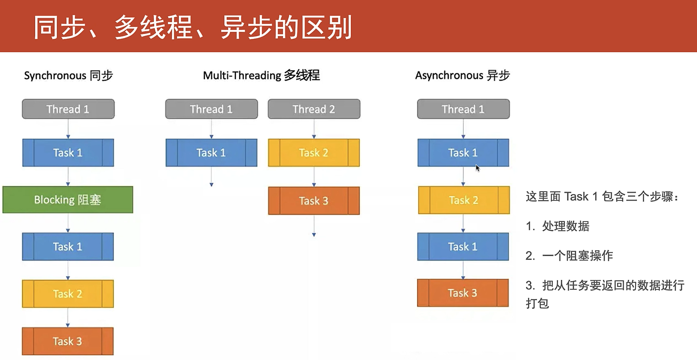
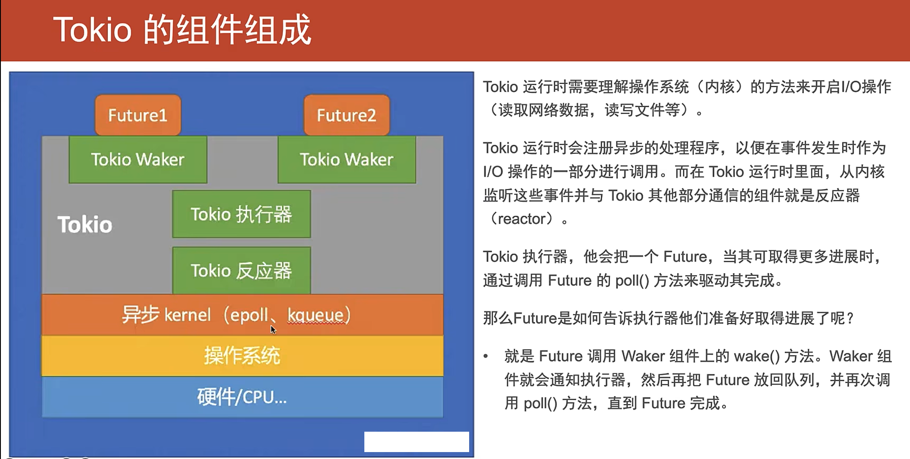
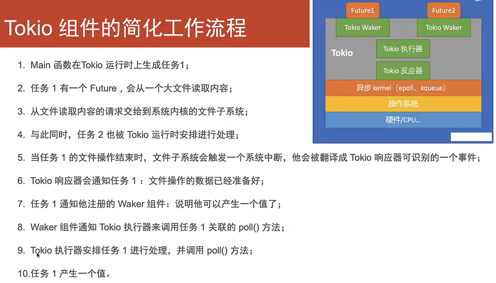

# Rust Async 异步教程

## 异步编程

并发和并行

- 并发: 程序的不同部分`同时`不按顺序的执行在`不同的cpu核上`且不影响最终结果的能力。  
- 并行: 多个任务同时执行。（分别在两个cpu核上同时执行两个任务）

### CPU和IO密集型任务

-cpu密集型： 占用很多cpu资源的任务。文件压缩，视频解码，图形处理和计算加密等。    
-IO密集型： 占用很多I/O的任务，从文件系统或数据库访问数据，以及处理TCP/HTTP请求。

两个例子：   
1. web项目中把数据从数据库传过来，写入磁盘，但磁盘写入操作很慢，与此同时，CPU就是在干等。如何让cpu在这段等待的事件执行其他任务。
2. 网络处理请求，client建立连接发送请求，server端处理请求并返回响应并关闭连接。当cpu还在处理前一个请求，第二个请求却已经到达，那么第二个请求必须在队列中等待第一个请求处理完成。如何把第二个请求安排到其他可用的cpu上？

## 同步、多线程、异步
假设有一个task1, 包含3个步骤：
1. 处理数据
2. 一个阻塞操作
3. 把任务要返回的数据进行打包

### 区别

- 同步：   
    `thread0: task1 -> blocking -> task1 (打包)-> task2 -> task3`
 
- 多线程：  
    `thread0: task1处理数据-> blocking 干等着 -> task1打包 -> 别的task`
    `thread: task2 -> task3 (假设task2和3是不需要阻塞的)`

- 异步：  
    就一个线程，先处理task1 step1处理数据，然后在step2阻塞等待的时候，先执行task2, 阻塞操作完成之后，再回到task1进行打包，再执行task3。  
    => cpu利用率提高了  
    `thread0：task1 -> (non-blocking)task2 -> task1 -> task3`  
    Q: 是在阻塞操作完成后，同时task2也完成后，在回到task1吗？

  

看一个理解tokio绿色线程并发执行的例子
```rust
use std::pin::Pin;
use std::task::{Context,Poll};
use std::future::Future;
use std::{thread};
use std::time::{Duration};
use chrono::{Utc};


#[tokio::main()]
async fn main() {
    
    let t1 = tokio::spawn(async {
        let future1 = read_file1();
        future1.await;
    });

    
    let t2 = tokio::spawn(async {
        let future2 = read_file2();
        future2.await;
    });

    let _ = tokio::join!(t1,t2);
}

async fn read_file2() -> String {
    println!("file2 pre-work...{:?}", Utc::now());
    thread::sleep(Duration::new(2, 0));
    println!( "Processing file 2 {:?}", Utc::now());   
    String::from("Hello, there from file 2.")
}

async fn read_file1() -> String {
    println!("file1 pre-work... {:?}", Utc::now());
    thread::sleep(Duration::new(4, 0));
    println!("Processing file 1 {:?}", Utc::now());
    String::from("Hello, there from file 1.")
}

/*
thread0:

t1 file 1 pre-working
t1 blocking -----> t2 file 2 pre-working                             
    |2m            t2 blocking
t1 next                 | 4m
t1 done --------------->|
                    t2 next
                    t2 done
 */

```
输出: 对比同步执行的时间2+4s,和多线程和异步的执行的时间是4s。
```rust
warning: `async-yx` (bin "async-yx") generated 1 warning
    Finished dev [unoptimized + debuginfo] target(s) in 1.20s
     Running `target/debug/async-yx`
file1 pre-work... 2023-06-04T09:05:14.670932235Z
file2 pre-work...2023-06-04T09:05:14.670933435Z 
Processing file 2 2023-06-04T09:05:16.671071275Z //2s passed
Processing file 1 2023-06-04T09:05:18.671050701Z //another 2s passed
```


## 理解Async

cpu等待外部事件或动作时，异步运行时可以安排其他可继续执行的任务在CPU上执行。

## 理解Future
`async fn -> future`
Future是异步计算或函数产生的单一最终值。异步函数都会返回future，future就代表延迟的计算。  
```rust
use std::future::Future;
fn read_from_file() -> impl Future<Output=String> {
    async {...}
}

/*完全等价的写法*/

async fn read_from_file -> String {...}

```
### async 总结
`async`块和`async fn`是一样的，就是告诉编译器创建一个`Future`。`async` 是语法糖,为开发者自动生成返回值是`impl Future`类型的函数。

```rust
pub trait Future {
    type Output; //代表future成功完成后，应该返回的数据类型
    //poll方法返回一个枚举Poll
    fn poll(self: Pin<&mut Self>, cx: &mut Context<'_>) -> Poll<Self::Output>;
}

pub enum Poll {
    Ready(T), //T就是包着要返回的值
    Pending,
}
```
`poll`方法是被*异步运行时*中的`executor`异步执行器调用的，用来检查异步任务是否已经完成。异步执行器会管理一个Future的集合，并通过Future上的poll方法来驱动他们完成，所以函数或者代码块前面加上async之后，相当于高祖执行器会返回Future, 这个Furture需要被驱动直到`Ready(T)`。  

异步执行器是否会持续poll吗？否。Tokio是使用一个Waker组件来处理poll。

```rust
fn poll(self: Pin<&mut Self>, cx: &mut Context<'_>) -> Poll<Self::Output> {
    println!("Tokio, stop polling me!");
    Poll::Pending
}
```  
如果future的值不可用（`Poll::pending`），那么就会注册到`Waker`上。Waker会有一个处理程序handle, 它会被储存在任务相关的Context对象中。

`Waker`中有一个`wake()`方法，来告诉异步执行器关联的任务应该被唤醒了。wake()方法被调用，执行器就会再次poll()这个函数的future。  

看一个不使用wake()的例子：
```rust

#[tokio::main()]
async fn main() {
    
    // let t1 = tokio::spawn(async {
    //     let future1 = read_file1();
    //     future1.await;
    // });

    
    let t2 = tokio::spawn(async {
        let future2 = read_file2();
        future2.await;
    });

    let t3 = tokio::spawn(async {
        let future3 = ReadFileFuture {};
        future3.await
    });

    let _ = tokio::join!(t2,t3);
}

struct ReadFileFuture {}

impl Future for ReadFileFuture {
    type Output = String;
    // 由于future会被异步运行时反复的poll,所以把future固定Pin到内存中的特定位置不允许移动，必要安全性
    fn poll(self: Pin<&mut Self>, _cx: &mut Context<'_>) -> Poll<Self::Output>{
        println!("tokio, Stop polling me!");
        Poll::Pending
    }
}
```
- 执行顺序：  
1. main 生成task1  
2. main 生成task2  
3. task1调用自定义的Future, Future返回Pending  
4. task2调用异步函数read_file2(), 2s后函数返回  

> 只有task2会输出，因为task1中的异步函数的future被poll了一次显示pending, 就不会再次poll  

进行waker的修改：  

```rust
impl Future for ReadFileFuture {
    type Output = String;
    // 由于future会被异步运行时反复的poll,所以把future固定Pin到内存中的特定位置不允许移动，必要安全性
    fn poll(self: Pin<&mut Self>, _cx: &mut Context<'_>) -> Poll<Self::Output>{
        println!("tokio, Stop polling me!");
        _cx.waker().wake_by_ref(); //告诉执行器再次poll，poll函数继续从头被调用
        Poll::Pending
    }
}
```
`_cx.waker().wake_by_ref();` 告诉执行器再次poll，poll函数继续从头被调用。  
<br>
- 执行顺序：  
1. main 生成task1  
2. main 生成task2  
3. task1调用自定义的Future, 调用Waker的wake方法，这就告诉执行器再次去poll这个future,而这个Future一直返回返回Pending，导致这个操作一直循环进行。  
4. task2调用异步函数read_file2(), 2s后函数返回 。

# Tokio 组件组成


### tokio工作组件简化流程  



### 例题：  
创建一个自定义的Future, 他是一个定时器，具有以下功能：
1. 可设定超时时间
2. 当被异步运行时poll时，他会检查：
    - 如果当前时间 >= 超时时间，则返回Poll::Ready, 里面带一个String值  
    - 如果当前时间 < 超时时间，则他会睡眠到超时位置。然后他会触发waker上的wake()方法，这就会通知异步运行时的执行器来安排并再次执行该任务。

```rust
use std::future::Future;
use std::thread;

struct MyFuture {
    expiration_time: Instant;
};

impl Future for MyFuture {
    type Output = String;
    fn poll(self: Pin<&mut Self>, cx: Context<'_>) -> Poll<Self::Output> {
        let cur_time = Instant::now();
        
        if cur_time >= self.time_out {
            Poll::Ready(String::from("MyFuture has been timeout"))
        } else {
            thread::sleep(Duration::new(time_out - cur_time, 0));
            cx.waker().wake_by_ref();
            Poll::Pending
        }
    }
}
```

改正：
```rust
use std::future::Future;
use std::thread;

struct MyFuture {
    expiration_time: Instant;
};

impl Future for MyFuture {
    type Output = String;
    fn poll(self: Pin<&mut Self>, cx: Context<'_>) -> Poll<Self::Output> {
        let cur_time = Instant::now();
        
        if cur_time >= self.time_out {
            Poll::Ready(String::from("MyFuture has been timeout"))
        } else {
                    let waker = cx.waker().clone;
                    let expiration_time = self.expiration_time;
                    thread::spawn (move || {
                        let cur_time = Instant::now();
                        if current_time <　expiration_time {　
                            thread::sleep(expiration_time - cur_tim));
                        }
                        
                    });
                }   
            }
    }   
}
```